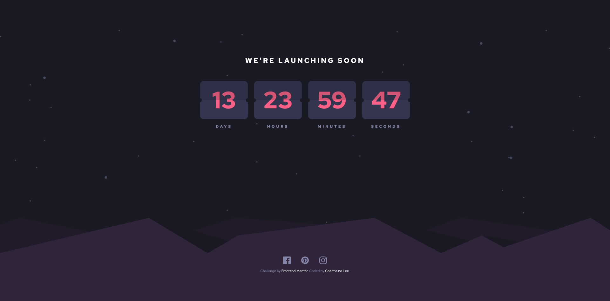

# Frontend Mentor - Launch countdown timer solution

This is a solution to the [Launch countdown timer challenge on Frontend Mentor](https://www.frontendmentor.io/challenges/launch-countdown-timer-N0XkGfyz-). Frontend Mentor challenges help you improve your coding skills by building realistic projects.

## Table of contents

- [Overview](#overview)
  - [The challenge](#the-challenge)
  - [Screenshot](#screenshot)
  - [Links](#links)
- [My process](#my-process)
  - [Built with](#built-with)
- [Author](#author)

## Overview

### The challenge

Users should be able to:

- See hover states for all interactive elements on the page
- See a live countdown timer that ticks down every second (start the count at 14 days)
- **Bonus**: When a number changes, make the card flip from the middle

### Screenshot

### Links

- Solution URL: [https://www.frontendmentor.io/solutions/countdown-timer-using-vanillar-js-sass-css-grid-eXDFLxYa8V](https://www.frontendmentor.io/solutions/countdown-timer-using-vanillar-js-sass-css-grid-eXDFLxYa8V)
- Live Site URL: [https://fmentor-countdown-timer.netlify.app/](https://fmentor-countdown-timer.netlify.app/)

## My process

### Built with

- Semantic HTML5 markup
- Flexbox
- CSS Grid
- Sass
- Mobile-first workflow

## Author

- Website - [Charmaine Lee](https://charmainelhm.netlify.app/)
- Frontend Mentor - [@charmainelhm](https://www.frontendmentor.io/profile/charmainelhm)
- Twitter - [@noodercob_ie](https://www.twitter.com/noodercob_ie)
